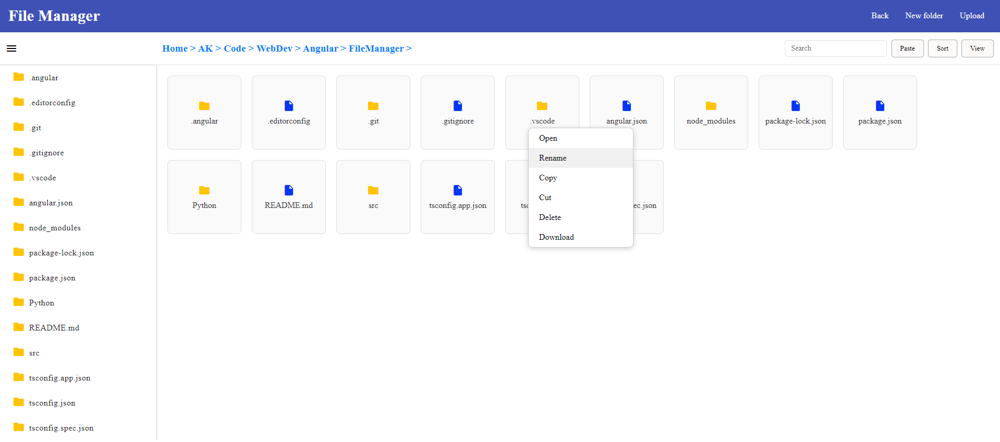

# FileManager
An application that allows users to navigate, view, and manage local files and directories efficiently.

## Tech Stack:
  - **Frontend**:
    - **Angular**: Frontend framework for building the user interface.
    - **TypeScript**: Programming language used for writing the Angular application.
    - **Angular Material**: UI component library for Angular to provide a consistent design.
    - **HTML/CSS**: Markup and styling for the application.
    - **RxJS**: Library for reactive programming using observables, used for handling asynchronous data streams.
  - **Backend**:
    - **Python**: Programming language used for the backend.
    - **Flask**: Web framework for Python to handle routing and middleware.
    - **os Module**: Python module for interacting with the file system to perform file operations.
  - **HTTP Client**:
    - **HttpClientModule**: Angular module for making HTTP requests to interact with backend services.

## Features
  - Search
  - Sort
  - Copy
  - Cut
  - Delete
  - Rename
  - Download

## Snap
  

## Contributions 🤝

All contributions are welcome and appreciated! If you find any issues (there are many btw), have suggestions, or want to add new features, you are welcome to create a PR.
Thank you in advance for contributing to this project! 🚀

## Connect 

## 
### Leave a 🌟 if it was Helpful!!
### Thanks!

